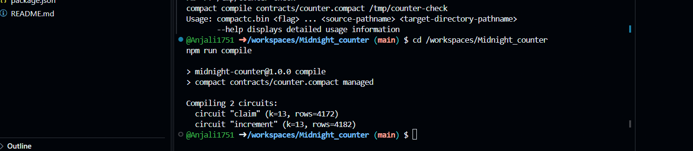
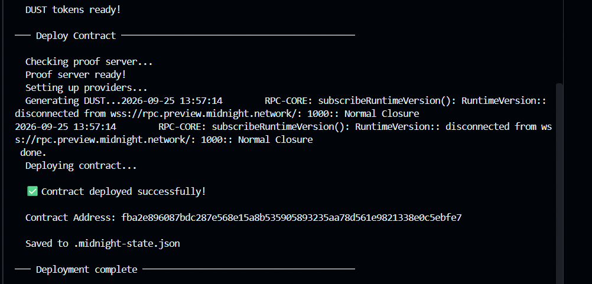

# Private-Owner Counter

> A privacy-preserving Midnight Compact counter where ownership is proven with a private secret key without revealing the key on-chain.

## Contract Address

| Network | Address |
| --- | --- |
| Preview | `6a9f45c19b671944eff8cbe3a0f2d3c02511d1b01fbabaff6476682d9d2930c8` |
| Preprod | `6a9f45c19b671944eff8cbe3a0f2d3c02511d1b01fbabaff6476682d9d2930c8` |

## Live Demo

https://midnightcounter.vercel.app

## What This Does

This contract starts in an unclaimed state. A user can claim ownership by proving they know a secret key without exposing that secret on-chain. Once claimed, the owner may increment the public counter while callers without the matching secret key are rejected.

The contract stores a public hash commitment for ownership and a public count value, while the secret itself remains private and is never revealed to the ledger.

## Privacy Model

- **PUBLIC (on-chain, visible to anyone):** the contract `state`, the public `owner` hash commitment, and the public `count` value.
- **PRIVATE (never on-chain):** the secret key returned by the `localSecretKey()` witness.
- **PROVED without revealing:** the caller demonstrates knowledge of the secret behind the public owner commitment.

The hash commitment is disclosed during `claim()`, but the underlying secret remains hidden.

## Privacy Claim

An on-chain observer can see the counter state, the owner hash commitment, and each successful increment. They cannot see the owner's secret key; `increment()` proves knowledge of the key matching the commitment without revealing the key.

## Tech Stack

- Midnight Network
- Compact language
- Midnight.js SDK and DApp Connector API
- React and Vite
- Lace wallet
- Node.js v22
- Docker

## Prerequisites

- Node.js v22 and npm
- Lace wallet installed and configured for Preprod
- Compact CLI/compiler `0.31.1`
- Docker running locally
- Access to the Midnight Preview or Preprod network
- A funded Preprod wallet for deployment

## Run Locally

```sh
git clone <repository-url>
cd Midnight_counter
nvm use 22
npm ci
cp .env.example .env
npm run dev
```

The app uses Lace's DApp Connector to request a Preprod connection, show the wallet address, and clear the local connection state on disconnect. It reports missing Lace, a declined connection, and a network mismatch.

`VITE_CONTRACT_ADDRESS` is reserved for the deployed Preprod contract. The current frontend does not yet read the on-chain count, generate a proof, or submit a transaction. The increment button remains disabled because the generated contract runtime and transaction providers are not wired up; setting the address alone will not enable it.

## Deploy Frontend

After deploying the Compact contract to Preprod, configure Vercel and deploy:

```sh
npx vercel login
npx vercel link
npx vercel env add VITE_CONTRACT_ADDRESS production
npx vercel env add VITE_MIDNIGHT_NETWORK_ID production
npx vercel --prod
```

Enter the deployed Preprod contract address when prompted for `VITE_CONTRACT_ADDRESS`, and `preprod` for `VITE_MIDNIGHT_NETWORK_ID`. Add the production URL to the Live Demo section above.

## Compile Contract

```sh
mkdir -p "$HOME/.local/bin"
curl -fL https://github.com/LFDT-Minokawa/compact/releases/download/compactc-v0.31.1/compactc_v0.31.1_x86_64-unknown-linux-musl.zip -o /tmp/compactc.zip
unzip -o /tmp/compactc.zip -d /tmp/compactc-install
cp /tmp/compactc-install/* "$HOME/.local/bin/"
chmod +x "$HOME/.local/bin"/*
ln -sf "$HOME/.local/bin/compactc" "$HOME/.local/bin/compact"
export PATH="$HOME/.local/bin:$PATH"
```

Verify the toolchain before compiling:

```sh
node --version
compact --version
```

The challenge prompt's `npm install -g @midnight-ntwrk/compact-compiler`
command currently returns `404` from npm. This project uses the direct compiler
installation and script flow required by Compact `0.31.1`.

Compile the contract and generate the managed artifacts:

```sh
npm run compile
```

The generated `managed/` directory contains the contract interface, circuits,
and proving and verification keys.

## Demo Video

Placeholder: add the recording link after filming. Record the requested circuit flow only after proof generation and transaction submission are integrated; those actions are not available in the current frontend.

1. Connect Lace and show the wallet address.
2. Call the circuit and show proof-generation loading.
3. Show the on-chain result after submission.
4. Point out that the private input is never displayed.

## Run Tests

```sh
npm test
```

The test suite validates the contract logic, generated compiler metadata, public ledger transitions, and the private witness model. A full transaction-level test requires the Midnight runtime, proof server, and a funded wallet.

## Screenshots

### Compile output



### Deployment screenshot



> Save the compile screenshot as `compile.png` and the deployment screenshot as `deploy.png` in the `docs/screenshots` folder before pushing.